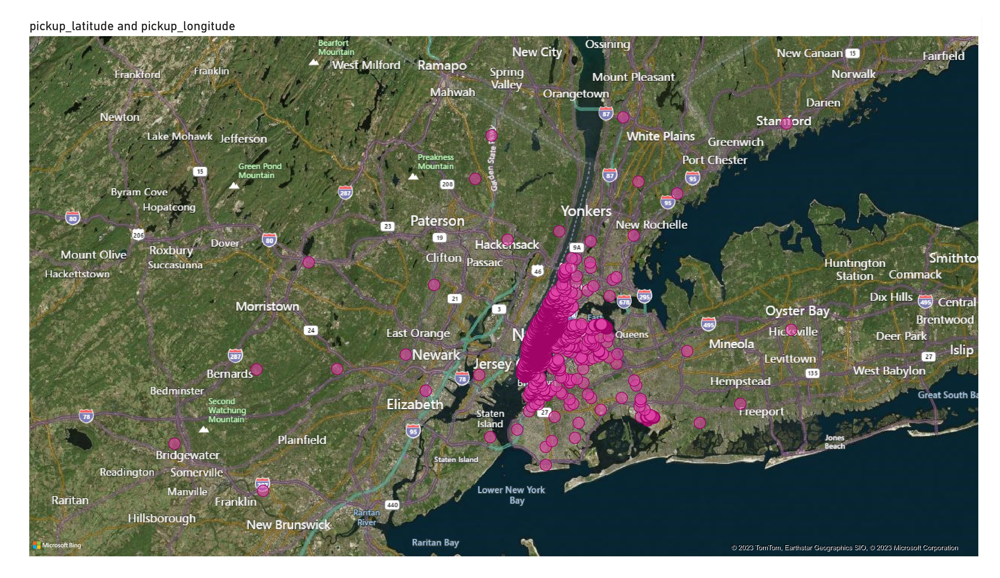
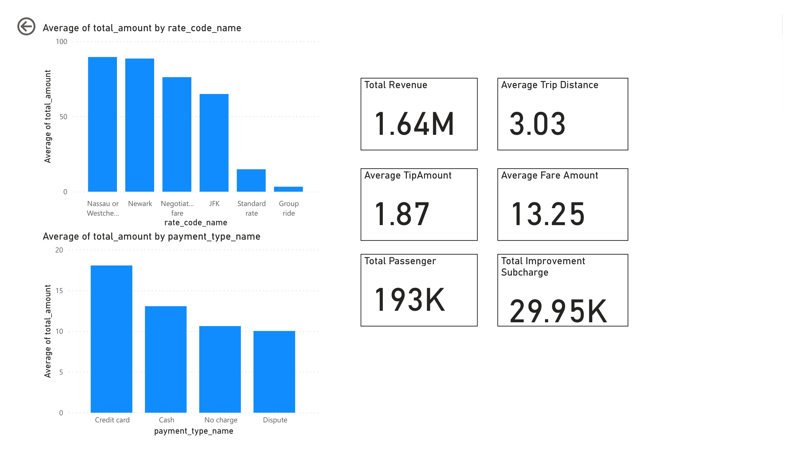

# Datasets Description
https://www.nyc.gov/site/tlc/about/tlc-trip-record-data.page
https://www.nyc.gov/assets/tlc/downloads/pdf/data_dictionary_trip_records_yellow.pdf

# Data Model (Rough)


## Once the ETL has been completed, a view has to be created for PowerBI dataset
```
CREATE OR REPLACE VIEW analytics AS
SELECT
  f."VendorID",
  dt.tpep_pickup_datetime,
  dt.tpep_dropoff_datetime,
  p.passenger_count,
  td.trip_distance,
  rc.rate_code_name,
  f.store_and_fwd_flag,
  pl.pickup_latitude,
  pl.pickup_longitude,
  dl.dropoff_latitude,
  dl.dropoff_longitude,
  pt.payment_type_name,
  f.fare_amount,
  f.extra,
  f.mta_tax,
  f.tip_amount,
  f.tolls_amount,
  f.improvement_surcharge,
  f.total_amount
FROM
  fact_table f
  JOIN passenger_count_dim p ON f.passenger_count_id = p.passenger_count_id
  JOIN trip_distance_dim td ON f.trip_distance_id = td.trip_distance_id
  JOIN rate_code_dim rc ON f.rate_code_id = rc.rate_code_id
  JOIN pickup_location_dim pl ON f.pickup_location_id = pl.pickup_location_id
  JOIN dropoff_location_dim dl ON f.dropoff_location_id = dl.dropoff_location_id
  JOIN payment_type_dim pt ON f.payment_type_id = pt.payment_type_id
  JOIN datetime_dim dt On f.datetime_id = dt.datetime_id;
```

## Now, Connect Postgres to PowerBI and load the dataset from this view.
### Output from PowerBI:


